 # HikariList, página de gestión de series anime


<br>

## Indice 
- [¿Qué es HikariList?](#qué-es-hikarilist)
- [¿Cómo funciona la aplicación?](#cómo-funciona-la-aplicación)
- [Tutorial](#TUTORIAL)
- [Diseño de la web](#diseño-de-la-web)
- [Backend  y panel de administrador](#backend-y-panel-de-administrador)
- [Despliegue del proyecto](#despliegue-del-proyecto)

<br>

## ¿Qué es HikariList?
- HikariList es una aplicación de gestíon de series y peliculas animes dónde los usuarios pueden gestionar todas las series que quieran ver o hayan visto y tener su propia biblioteca digital, además de puntuar las obras que haya visto. La aplicación dispone de un ranking con las obras mejores votadas.

<br>

## ¿En qué destaca HikariList?
- HikariList destaca en su diseño simple y limpio, destinada a todos esos usuarios que no tienen experiencia en navegar por páginas webs complejas y quieren algo que no requiera mucha dificultad de uso, todos esos amantes de los animes que simplemente quieran disfrutar del anime y controlar todo lo que ven, ¡es su sitio!

<br>

## ¿Qué tecnologias se han utilizado para desarrollar HikariList?
- Esta página web tiene su base en el lenguaje de programación python, en el framework de Django.
- En la parte de diseño se utiliza HTML, CSS y Javascript, además de boostrap
- En la parte de despligue he desplegado mi proyecto utilizando Docker en una instancia AWS asociada a una IP elástica, con un dominio de tech.domains.
- Para la base de datos he utilizado PostgresSQL


<br>

## ¿Cómo funciona la aplicación?
- Esta aplicación está desplegada con docker en una instancia en AWS y accesible desde la URL hikarilist.yelardo.tech, sin embargo, también podréis acceder a la app instalandola de manera local, voy a proceder a explicar como podéis ejecutar la aplicación web en local:


 1.- Descargue el código en un .zip y descomprimalo
 
 2.- Una vez descomprimido, o bien en un IDE o en una consola de comandos, ejecute lo siguiente:
 ```python

docker compose build

````
3.- Con ese comando habremos construido nuestra imagen docker, ahora vamos a levantarlo: 
```python

docker compose up -d

````
4.- Luego debemos aplicar las migraciones 
```python

docker compose exec web python manage.py migrate

````
5.-Con todo listo podemos acceder al proyecto añadiendo la siguiente ruta dentro del navegador
```python

http://localhost:8000/

````
6.- Si simplemente deseas visitar la web, te dejo aquí la url de al app
```python

http://hikarilist.yelardo.tech

````
<br>

# Tutorial

## Antes de empezar a hablar del despliegue, el diseño y el backend, voy a hacer un pequeño tutorial muy sencillo de cómo funciona mi web: 

<br>

### Inicio:
- Una vez despleguemos la web, ya sea en local o desde la url, nos aparecerá lo siguiente:
<br>


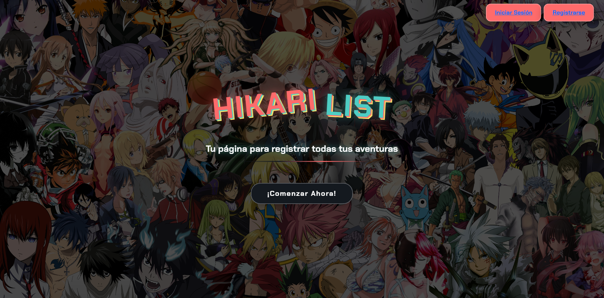

<br>


- Una vez iniciemos sesión, o nos registremos por primera vez, le deberemos de dar al botón de comenzar:
<br>

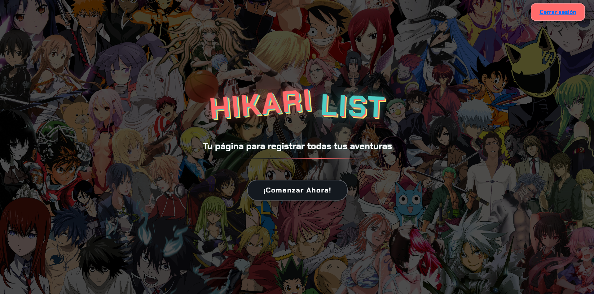

<br>


### Página principal:
 - Esta es la página principal, donde tendremos siempre a nuestra disposición la barra de navegación, para movernos por la app, además de unas noticias destacadas de la semana y los animes mas destacados de ella.
   <br>

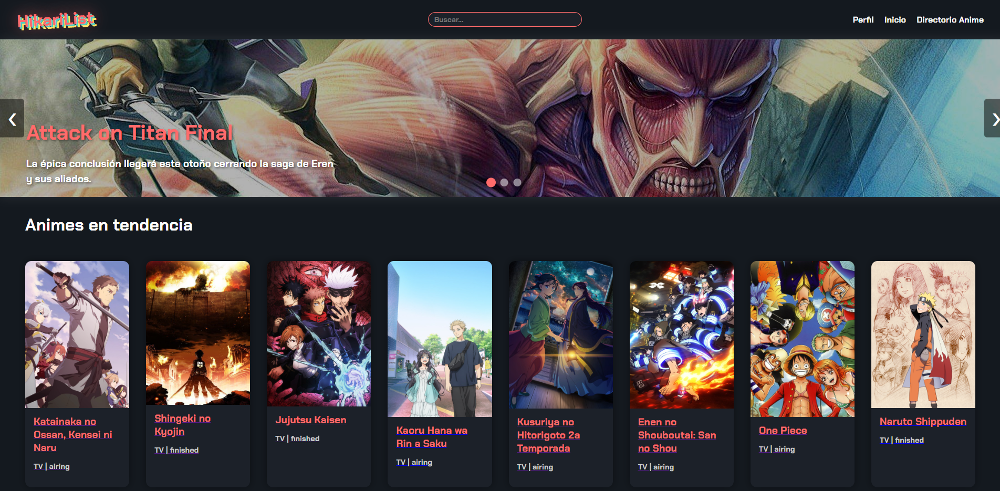
<br>


 - También tendremos la barra de busqueda que nos permitirá buscar el anime que queramos

<br>

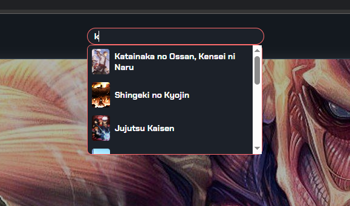

<br>


- Si seguimos bajando tendremos los animes más destacados de esta temporada primavera-verano

<br>


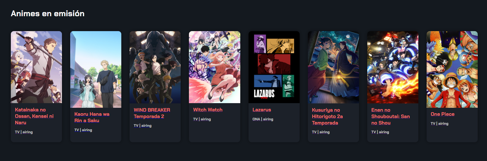

<br>


- Por último tendríamos los animes mejores valorados por los usuarios de la web
<br>

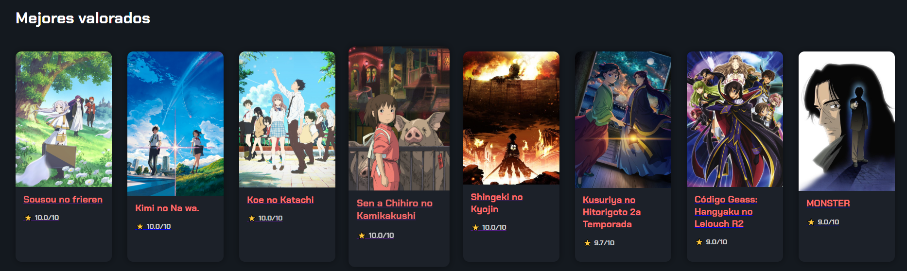
<br>


### Detalles de los animes:

- Si pulsamos en cualquier anime, nos aparecerá la información sobre dicho anime, una breve sinopsis y además podremos añadirlo a nuestra lista dependiendo de la categoría en la que lo queramos meter, y podremos añadirle una nota.
<br>

 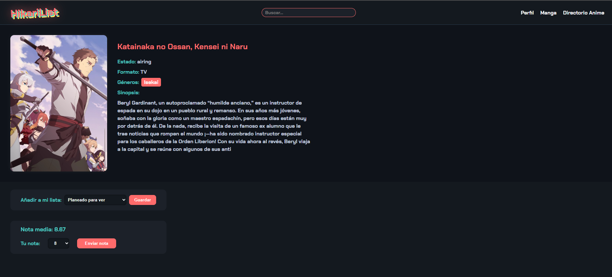
<br>

### Perfil:

- Si pulsamos en el botón de perfil, nos llevara a nuestro perfil, donde se nos asignará un avatar por defecto pero podremos cambiarlo, nos pondrá desde cuando somos miembros de la página y tendremos acceso a nuestra biblioteca entera, y podrémos ir viendo todos los animes que hemos añadido y en que estado los tenemos, además de el numero total de animes de cada sección.
<br>

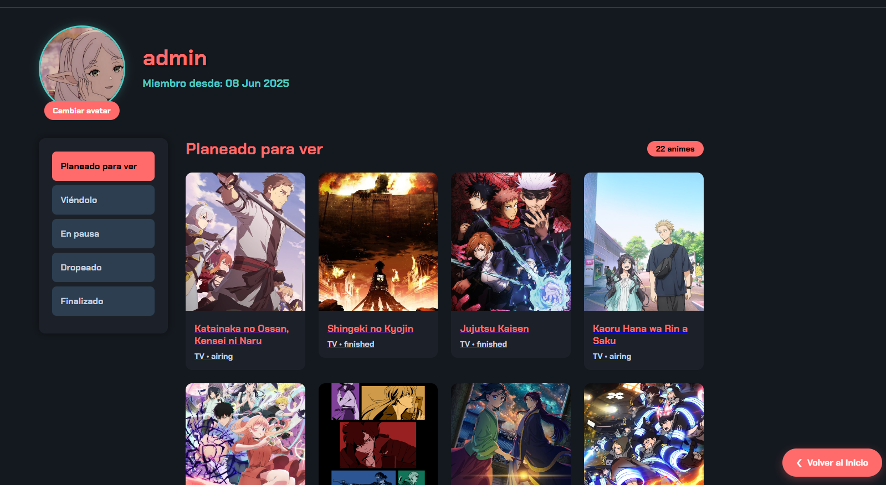
<br>


### Directorio anime:

- Si pulsamos en directorio anime, nos llevará a una página con todo el catalogo anime que existe en la web.
<br>

 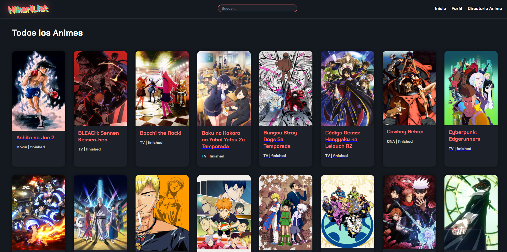
<br>
<br>


# Diseño de la web

<br>

- Para el diseño de la web, he utilizado html, css, boostrap y javascript.

<br>

- La font principal de la página la he cogido de google fonts:

<br>

  ```python
  https://fonts.google.com/specimen/Chakra+Petch
  ````

<br>

- El color predominante de la web y utilizado en la mayor parte de ella es el siguiente:

<br>

  ```python
  #ff6b6b
  ````
<br>

- El css principal de la aplicación:

<br>

  ```python
  @import url('https://fonts.googleapis.com/css2?family=Chakra+Petch:wght@700&display=swap');

  body {
      font-family: 'Chakra Petch', sans-serif;
      background-color: #0b0e14;
      color: #fff;
      margin: 0;
      padding: 0;
  }
  
  .anime-bg {
      background-color: #14191f;
      min-height: 100vh;
  }
  
  header {
      background-color: #14191f;
      padding: 1rem 2rem;
      display: flex;
      justify-content: space-between;
      align-items: center;
      border-bottom: 1px solid #2c3e50;
  }
  
  header h1 {
      font-size: 2rem;
      color: #4ecdc4;
      margin: 0;
  }
  
  header nav a {
      color: #fff;
      text-decoration: none;
      margin-left: 1rem;
      font-size: 1rem;
      transition: color 0.3s ease;
  }
  
  header nav a:hover {
      color: #4ecdc4;
  }
  
  header nav .search-wrapper {
      margin-right: 1rem;
      order: 0;
      width: 170px;
  }
  
  .logo {
      color: #ff6b6b;
      display: inline-block;
      transform: rotate(-3deg);
      margin-right: 25px;
      text-shadow:
          3px 3px 0 #4ecdc4,
          6px 6px 0 #ffe66d,
          0 0 30px rgba(255,107,107,0.8);
      animation: float 3s ease-in-out infinite;
  }
  
  .grid,
  section.grid {
      display: grid;
      grid-template-columns: repeat(auto-fill, minmax(180px, 1fr));
      gap: 2rem;
      padding: 2rem;
      margin: 0 1rem;
  }
  
  .card {
      background: #1c2129;
      border-radius: 12px;
      overflow: hidden;
      box-shadow: 0 0 15px rgba(0,0,0,0.4);
      transition: transform 0.3s ease;
  }
  
  .card:hover {
      transform: scale(1.05);
  }
  
  .card img {
      width: 100%;
      height: auto;
      display: block;
  }
  
  .card h2 {
      font-size: 1.2rem;
      margin: 0.8rem 0 0.4rem 0;
      padding: 0 1rem;
      color: #ff6b6b;
  }
  
  .card p {
      font-size: 0.9rem;
      color: #ccc;
      padding: 0 1rem 1rem;
  }
  
  .anime-detail {
      display: flex;
      flex-wrap: wrap;
      gap: 2rem;
      padding: 2rem;
      background-color: #0f131a;
  }
  
  .anime-detail img {
      width: 300px;
      max-width: 100%;
      border-radius: 12px;
      box-shadow: 0 0 10px rgba(255, 255, 255, 0.05);
  }
  
  .anime-detail div {
      max-width: 600px;
  }
  
  .anime-detail p {
      margin: 0.5rem 0;
      line-height: 1.5;
      color: #c7d2e2;
  }
  
  .anime-detail strong {
      color: #4ecdc4;
  }
  
  h1 {
      margin: 2rem 1rem 1rem 3rem;
  }
  
  #search-input,
  #search-preview {
      font-family: 'Chakra Petch', sans-serif;
      font-size: 1rem;
  }
  
  .add-list-form {
      margin: 2rem 2rem;
      display: flex;
      align-items: center;
      gap: 1rem;
      background: #1c2129;
      padding: 1rem 2rem;
      border-radius: 12px;
      max-width: 420px;
      font-weight: 700;
      color: #ff6b6b;
      justify-content: space-between;
  }
  
  .add-list-form label {
      font-size: 1rem;
      color: #4ecdc4;
      white-space: nowrap;
      flex-shrink: 0;
      min-width: 120px;
  }
  
  .add-list-form select {
      flex-grow: 1;
      padding: 0.5rem 1rem;
      border-radius: 8px;
      border: none;
      background-color: #14191f;
      color: #fff;
      font-weight: 700;
      cursor: pointer;
      transition: background-color 0.3s ease;
      box-shadow: inset 0 0 5px rgba(0,0,0,0.5);
  }
  
  .add-list-form select:hover,
  .add-list-form select:focus {
      background-color: #4ecdc4;
      color: #14191f;
      outline: none;
  }
  
  .add-list-form button {
      padding: 0.5rem 1.5rem;
      background: #ff6b6b;
      color: #fff;
      border: none;
      border-radius: 8px;
      font-weight: 700;
      cursor: pointer;
      transition: background-color 0.3s ease, box-shadow 0.3s ease;
      flex-shrink: 0;
  }
  
  .add-list-form button:hover {
      background-color: #e05a5a;
      box-shadow:
          0 0 12px #e05a5a,
          0 0 30px #e05a5a;
  }
  
  
  #rating-section {
      margin: 2rem 2rem;
      background: #1c2129;
      padding: 1rem 2rem;
      border-radius: 12px;
      max-width: 420px;
      color: #4ecdc4;
      font-weight: 700;
      display: flex;
      align-items: center;
      gap: 1rem;
      justify-content: flex-start;
      flex-wrap: wrap;
  }
  
  #rating-section p#avg-score {
      margin: 0 1rem 0 0;
      font-size: 1.1rem;
      flex: 1 1 100%;
  }
  
  #rating-section label {
      margin-right: 0.5rem;
      font-weight: 700;
      flex-shrink: 0;
  }
  
  #score-input {
      padding: 0.5rem 1rem;
      border-radius: 8px;
      border: none;
      background-color: #14191f;
      color: #fff;
      font-weight: 700;
      cursor: pointer;
      transition: background-color 0.3s ease;
      box-shadow: inset 0 0 5px rgba(0,0,0,0.5);
  }
  
  #score-input:hover,
  #score-input:focus {
      background-color: #4ecdc4;
      color: #14191f;
      outline: none;
  }
  
  #submit-score {
      padding: 0.5rem 1.5rem;
      background: #ff6b6b;
      color: #fff;
      border: none;
      border-radius: 8px;
      font-weight: 700;
      cursor: pointer;
      margin-left: 0.5rem;
      transition: background-color 0.3s ease, box-shadow 0.3s ease;
  }
  
  #submit-score:hover {
      background-color: #e05a5a;
      box-shadow:
          0 0 12px #e05a5a,
          0 0 30px #e05a5a;
  }
  
  /* Responsive */
  @media (max-width: 768px) {
      header {
          flex-direction: column;
          align-items: flex-start;
          padding: 1rem;
      }

    header nav {
        width: 100%;
        display: flex;
        flex-wrap: wrap;
        gap: 0.5rem;
        margin-top: 0.5rem;
    }

    header nav a {
        margin: 0;
        font-size: 0.95rem;
        flex: 1 1 auto;
        text-align: center;
    }

    header nav .search-wrapper {
        order: 2;
        width: 100%;
        margin-top: 0.5rem;
    }

    header h1 {
        font-size: 1.5rem;
        margin-bottom: 0.5rem;
    }

    .grid,
    section.grid {
        grid-template-columns: repeat(auto-fill, minmax(150px, 1fr));
        padding: 1rem;
        gap: 1.5rem;
    }

    .anime-detail {
        flex-direction: column;
        align-items: center;
        padding: 1rem;
    }

    .anime-detail div {
        max-width: 100%;
        text-align: center;
        padding: 0 1rem;
    }

    .anime-detail img {
        width: 100%;
        max-width: 300px;
    }
    }
    
    @media (max-width: 576px) {
        .grid,
        section.grid {
            grid-template-columns: repeat(auto-fill, minmax(140px, 1fr));
            gap: 1rem;
            padding: 1rem;
        }

    .card h2 {
        font-size: 1rem;
        padding: 0 0.75rem;
    }

    .card p {
        font-size: 0.85rem;
        padding: 0 0.75rem 0.75rem;
    }

    .add-list-form,
    #rating-section {
        flex-direction: column;
        max-width: 100%;
        margin: 1rem;
        padding: 1rem;
    }

    .add-list-form label,
    .add-list-form select,
    .add-list-form button,
    #score-input,
    #submit-score {
        width: 100%;
    }

    #rating-section label {
        width: 100%;
        margin-bottom: 0.25rem;
    }

    #rating-section p#avg-score {
        font-size: 1rem;
        margin: 0 0 0.5rem;
    }

    #submit-score {
        margin-left: 0;
        margin-top: 0.75rem;
        width: 100%;
    }
}

  ````


<br>

- La página sigue un diseño de cards para mostrar los animes tanto en la página principal, como en el perfil y en el directorio anime:

<br>

  ```python
  <h1>Animes en emisión</h1>
    <section class="grid">
        
        <article class="card">
            <a href="">
                
                <h2>{{ anime.title }}</h2>
                <p>{{ anime.format }} | {{ anime.status }}</p>
            </a>
        </article>
        
    </section>
    
  .card {
      background: #1c2129;
      border-radius: 12px;
      overflow: hidden;
      box-shadow: 0 0 15px rgba(0,0,0,0.4);
      transition: transform 0.3s ease;
  }
  
  .card:hover {
      transform: scale(1.05);
  }
  
  .card img {
      width: 100%;
      height: auto;
      display: block;
  }
  
  .card h2 {
      font-size: 1.2rem;
      margin: 0.8rem 0 0.4rem 0;
      padding: 0 1rem;
      color: #ff6b6b;
  }
  
  .card p {
      font-size: 0.9rem;
      color: #ccc;
      padding: 0 1rem 1rem;
  }
  ````

<br>

- La sección de noticias está hecha con carrousel de imágenes:
  ```python
     <div class="carousel">
        <div class="slides" id="slidesContainer">
            <div class="slide">
                
                <div class="slide-content">
                    <h3>Attack on Titan Final</h3>
                    <p>La épica conclusión llegará este otoño cerrando la saga de Eren y sus aliados.</p>
                </div>
            </div>

            <div class="slide">
                
                <div class="slide-content">
                    <h3>Demon Slayer: Castillo Infinito</h3>
                    <p>Nueva producción cinematográfica para cerrar el arco final.</p>
                </div>
            </div>

            <div class="slide">
                
                <div class="slide-content">
                    <h3>Jujutsu Kaisen Temporada 3</h3>
                    <p>El nuevo arco del Culling Game en producción para 2025.</p>
                </div>
            </div>
        </div>

        <div class="controls">
            <button class="prev" onclick="prevSlide()">❮</button>
            <button class="next" onclick="nextSlide()">❯</button>
        </div>

        <div class="indicators" id="indicatorsContainer"></div>
    </div>

  ````
  <br>

- Detalles de un anime

<br>

  ```python
    <!DOCTYPE html>
  <html lang="es">
  
  <head>
      <meta charset="UTF-8" />
      <title>{{ anime.title }} - HikariList</title>
      <meta name="viewport" content="width=device-width, initial-scale=1.0" />
      <link rel="stylesheet" href="" />
       <link rel="stylesheet" href="" />
      <link rel="stylesheet" href="" />
      <link href="https://fonts.googleapis.com/css2?family=Chakra+Petch:wght@700&display=swap" rel="stylesheet" />
      <style>
          .add-list-form {
              margin-top: 1.5rem;
              display: flex;
              align-items: center;
              gap: 0.5rem;
          }
          .add-list-form select {
              padding: 0.5rem;
          }
          .add-list-form button {
              padding: 0.5rem 1rem;
              background: #ff6b6b;
              color: #fff;
              border: none;
              cursor: pointer;
          }
      </style>
  </head>
  
  <body class="anime-bg">
      <header>
          <a href="">
              <h1 class="logo">HikariList</h1>
          </a>
           <div class="search-wrapper">
              <input id="search-input" type="text" placeholder="Buscar..." autocomplete="off" />
              <div id="search-preview"></div>
          </div>
         <nav>
              <a href="">Perfil</a>
              <a href="">Inicio</a>
              <a href="">Directorio Anime</a>
          </nav>
      </header>
      <section class="anime-detail">
          
          <div>
              <h2 style="color:  #ff6b6b;">{{ anime.title }}</h2>
              <p><strong>Estado:</strong> {{ anime.status }}</p>
              <p><strong>Formato:</strong> {{ anime.format }}</p>
              <p>
                  <strong>Géneros:</strong>
                  
                      <span
                          style="background-color: #ff6b6b; color: white; padding: 0.2rem 0.5rem; margin: 0.2rem; border-radius: 0.3rem;">
                          {{ genre.name }}
                      </span>
                  
              </p>
              <p><strong>Sinopsis:</strong></p>
              <p>{{ anime.description }}</p>
          </div>
      </section>
      <form method="post" class="add-list-form">
          
          <label for="status">Añadir a mi lista:</label>
          <select name="status" id="status">
              
                  <option value="{{ code }}" selected>
                      {{ label }}
                  </option>
              
          </select>
          <button type="submit">Guardar</button>
      </form>
      <div id="rating-section">
          <p id="avg-score">
              
                  Nota media: {{ avg_score }}
              
                  Este anime aún no tiene puntuaciones.
              
          </p>
          
              <label for="score-input">Tu nota:</label>
              <select id="score-input">
                  <option value="">—</option>
                  
                      <option value="{{ i }}" selected>{{ i }}</option>
                  
              </select>
              <button id="submit-score">Enviar nota</button>
          
              <p><a href="">Inicia sesión</a> para puntuar.</p>
          
      </div>
       <footer>
          <p>&copy; 2025 HikariList.</p>
      </footer>

  ````

<br>

- Perfil:

<br>

```python
<!DOCTYPE html>
<html lang="es">

<head>
    <meta charset="UTF-8">
    <meta name="viewport" content="width=device-width, initial-scale=1.0">
    <title>Perfil de Usuario</title>
    <link rel="stylesheet" href="">

    <link rel="stylesheet" href="">
    <link rel="stylesheet" href="" />
</head>
<body class="anime-bg">
    <header>
         <a href=""><h1 class="logo">HikariList</h1></a>
         <div class="search-wrapper">
            <input id="search-input" type="text" placeholder="Buscar..." autocomplete="off" />
            <div id="search-preview"></div>
        </div>
        <nav>
            <a href="">Inicio</a>
            <a href="">Perfil</a>
            <a href="">Cerrar Sesión</a>

        </nav>
    </header>
    <div class="anime-bg profile-container">
        <a href="" class="back-to-index">
            <span class="arrow">❮</span> Volver al Inicio
        </a>

        <section class="profile-header">
            <div class="avatar-card">
                <div class="avatar-wrapper">
                    
                        
                    
                        
                    
                </div>
                <form method="post" enctype="multipart/form-data" action="">
                    
                    <label class="upload-btn">
                        Cambiar avatar
                        <input type="file" name="avatar" onchange="this.form.submit()" hidden>
                    </label>
                </form>
            </div>

            <div class="profile-info">
                <h2>{{ user.username }}</h2>
                <p>Miembro desde: {{ user.date_joined|date:"d M Y" }}</p>
            </div>
        </section>

        <div class="profile-main">
            <aside class="status-nav">
                <ul class="status-tabs">
                    
                        <li data-status="{{ code }}" onclick="showTab('{{ code }}')">{{ label }}</li>
                    
                </ul>
            </aside>

            <section class="anime-lists">
                
                    <div class="anime-group" id="group-{{ code }}">
                        <div class="list-header">
                            <h3>{{ label }}</h3>
                            <span>{{ animes|length }} animes</span>
                        </div>

                        
                            <div class="grid">
                                
                                    <a href="" class="card">
                                        <div class="anime-card">
                                            
                                            <div class="anime-info">
                                                <h4>{{ ua.anime.title }}</h4>
                                                <p>{{ ua.anime.format }} • {{ ua.anime.status }}</p>
                                            </div>
                                        </div>
                                    </a>
                                
                            </div>
                        
                            <div class="empty-state">
                                <p>No tienes animes en esta categoría</p>
                            </div>
                        
                    </div>
                
            </section>
        </div>
    </div>
     <footer>
        <p>&copy; 2025 HikariList.</p>
    </footer>

    <script>
        window.onload = function() {
            showTab('{{ grouped_animes.0.0 }}');
            const defaultTab = document.querySelector(`[data-status="{{ grouped_animes.0.0 }}"]`);
            if (defaultTab) {
                defaultTab.classList.add('active');
            }
        }

        function showTab(status) {
            document.querySelectorAll('.anime-group').forEach(group => {
                group.style.display = 'none';
            });

            const activeGroup = document.getElementById(`group-${status}`);
            if (activeGroup) {
                activeGroup.style.display = 'block';
            }

            document.querySelectorAll('.status-tabs li').forEach(tab => {
                tab.classList.remove('active');
            });

            const activeTab = document.querySelector(`[data-status="${status}"]`);
            if (activeTab) {
                activeTab.classList.add('active');
            }
        }

        document.addEventListener('DOMContentLoaded', () => {
            const input = document.getElementById('search-input');
            const preview = document.getElementById('search-preview');
            const wrapper = document.querySelector('.search-wrapper');

            input.addEventListener('input', () => {
                const q = input.value.trim();
                if (!q) {
                    preview.classList.remove('show');
                    preview.innerHTML = '';
                    return;
                }
                fetch(`/anime/search/?q=${encodeURIComponent(q)}`)
                    .then(res => res.json())
                    .then(data => {
                        preview.innerHTML = '';
                        if (data.results.length) {
                            data.results.forEach(anime => {
                                const a = document.createElement('a');
                                a.href = `/anime/${anime.slug}/`;
                                a.innerHTML = `
                                
                                <span>${anime.title}</span>
                              `;
                                preview.appendChild(a);
                            });
                        } else {
                            preview.innerHTML = '<div class="px-2 py-1 text-gray-400 text-sm">Sin resultados</div>';
                        }
                        preview.classList.add('show');
                    })
                    .catch(() => preview.classList.remove('show'));
            });

            document.addEventListener('click', e => {
                if (!wrapper.contains(e.target)) {
                    preview.classList.remove('show');
                }
            });
        });


    </script>

</body>
</html>

````

<br>


# Backend y panel de administrador
- Esta web ha sido desarrollada en Django, usando un modelo de MVC, mi web está siendo controlada todo desde una misma app, dónde controlo todo lo que ocurre en ella desde el panel de administración.
  ### Modelos:
  - Aquí estan recogidos todos los modelos de mi aplicación, desde la gestión de todos los animes y la creación de ellos mismos hasta los usuarios y las notas medias.
 ```python

from django.db import models
from django.contrib.auth.models import User
from django.utils.text import slugify
from django.db.models import Avg

class Genre(models.Model):
    name = models.CharField(max_length=100)

    def __str__(self):
        return self.name

class Anime(models.Model):
    FORMAT_CHOICES = [
        ('TV', 'TV'),
        ('Movie', 'Movie'),
        ('OVA', 'OVA'),
        ('ONA', 'ONA'),
        ('Special', 'Special'),
    ]
    STATUS_CHOICES = [
        ('airing', 'En emisión'),
        ('finished', 'Finalizado'),
        ('upcoming', 'Proximamente'),
    ]

    title       = models.CharField(max_length=200)
    description = models.TextField(max_length=500, blank=True)
    slug        = models.SlugField(unique=True, blank=True)
    genres      = models.ManyToManyField(Genre, blank=True)
    image       = models.URLField(blank=True, default="https://via.placeholder.com/150")
    format      = models.CharField(max_length=20, choices=FORMAT_CHOICES)
    status      = models.CharField(max_length=20, choices=STATUS_CHOICES)
    episodes    = models.PositiveIntegerField()
    year        = models.DateField()
    is_trending = models.BooleanField(default=False)
    is_seasonal = models.BooleanField(default=False)

    def save(self, *args, **kwargs):
        if not self.slug:
            self.slug = slugify(self.title)
        super().save(*args, **kwargs)

    @property
    def aggregate_avg_score(self):
        agg = self.user_animes.exclude(score__isnull=True).aggregate(avg=Avg('score'))['avg']
        return round(agg or 0, 2)

    def __str__(self):
        return self.title

STATUS_CHOICES = [
    ('pending',   'Planeado para ver'),
    ('watching',  'Viéndolo'),
    ('paused',    'En pausa'),
    ('dropped',   'Dropeado'),
    ('completed', 'Finalizado'),
]

class Profile(models.Model):
    user   = models.OneToOneField(User, on_delete=models.CASCADE)
    avatar = models.ImageField(upload_to='avatars/', blank=True, null=True)

    def __str__(self):
        return self.user.username

class UserAnime(models.Model):
    """
    Relaciona usuarios y animes, con estado y puntuación.
    """
    user      = models.ForeignKey(User, on_delete=models.CASCADE)
    anime     = models.ForeignKey(Anime, on_delete=models.CASCADE, related_name='user_animes')
    status    = models.CharField(max_length=10, choices=STATUS_CHOICES, default='pending')
    score     = models.PositiveSmallIntegerField(null=True, blank=True)
    added_at  = models.DateTimeField(auto_now_add=True)

    class Meta:
        unique_together = ('user', 'anime')

    def __str__(self):
        return f"{self.user.username} – {self.anime.title} ({self.get_status_display()})"


````
<br>

### Views:
- Aquí esta la mayor parte de la lógica de la web, cómo funciona el sistema de biblioteca digital, el inicio de sesión, el buscado y la api para las notas medias de los animes.
```python

from django.shortcuts import render, redirect, get_object_or_404
from django.contrib.auth import login, logout
from django.contrib.auth.forms import AuthenticationForm
from django.contrib.auth.decorators import login_required
from django.http import JsonResponse
from django.db.models import Q, Avg
from rest_framework import viewsets, permissions
from .models import Anime, STATUS_CHOICES, UserAnime, Profile, Genre
from .forms import UserRegisterForm
from .serializers import AnimeSerializer, UserAnimeSerializer


def home(request):
    return render(request, 'home.html')


def register_view(request):
    if request.method == 'POST':
        form = UserRegisterForm(request.POST)
        if form.is_valid():
            user = form.save()
            login(request, user)
            return redirect('anime:home')
    else:
        form = UserRegisterForm()
    return render(request, 'registration/register.html', {'form': form})


def login_view(request):
    if request.method == 'POST':
        form = AuthenticationForm(request, data=request.POST)
        if form.is_valid():
            user = form.get_user()
            login(request, user)
            return redirect('anime:home')
    else:
        form = AuthenticationForm()
    return render(request, 'registration/login.html', {'form': form})


def logout_view(request):
    logout(request)
    return redirect('anime:home')


@login_required(login_url='anime:login')
def anime_index(request):
    trending = Anime.objects.filter(is_trending=True)
    seasonal = Anime.objects.filter(is_seasonal=True)
    top_rated = Anime.objects.annotate(avg=Avg('user_animes__score')) \
                     .filter(avg__isnull=False) \
                     .order_by('-avg')[:12]
    return render(request, 'pag_main/index.html', {
        'trending': trending,
        'seasonal': seasonal,
        'top_rated': top_rated,
    })


@login_required(login_url='anime:login')
def anime_detail(request, slug):
    anime = get_object_or_404(Anime, slug=slug)
    user_anime = None

    if request.user.is_authenticated:
        user_anime, _ = UserAnime.objects.get_or_create(user=request.user, anime=anime)
        if request.method == 'POST':
            status = request.POST.get('status')
            if status in dict(STATUS_CHOICES):
                user_anime.status = status
            score = request.POST.get('score')
            if score and score.isdigit() and 1 <= int(score) <= 10:
                user_anime.score = int(score)
            user_anime.save()
            return redirect('anime:detail', slug=slug)

    avg_score = UserAnime.objects.filter(anime=anime, score__isnull=False) \
                .aggregate(avg=Avg('score'))['avg']

    return render(request, 'pag_main/anime_details.html', {
        'anime': anime,
        'user_anime': user_anime,
        'status_choices': STATUS_CHOICES,
        'avg_score': round(avg_score, 2) if avg_score else None,
        'score_range': range(1, 11),  # Para el selector de puntuación
    })


@login_required(login_url='anime:login')
def profile_view(request):
    profile, _ = Profile.objects.get_or_create(user=request.user)
    user_list = UserAnime.objects.filter(user=request.user).select_related('anime')
    grouped = [
        (code, label, user_list.filter(status=code))
        for code, label in STATUS_CHOICES
    ]
    return render(request, 'user_profile/profile.html', {
        'profile': profile,
        'grouped_animes': grouped,
        'status_choices': STATUS_CHOICES,
    })


def anime_search(request):
    q = request.GET.get('q', '').strip()
    results = []
    if q:
        qs = Anime.objects.filter(Q(title__icontains=q))[:10]
        for anime in qs:
            results.append({'slug': anime.slug, 'title': anime.title, 'image': anime.image})
    return JsonResponse({'results': results})


#api
class AnimeViewSet(viewsets.ReadOnlyModelViewSet):

    queryset = Anime.objects.all()
    serializer_class = AnimeSerializer
    lookup_field = 'slug'

    def get_queryset(self):
        qs = super().get_queryset()
        if self.request.query_params.get('ordering') == 'top':
            qs = qs.annotate(avg=Avg('user_animes__score')) \
                   .filter(avg__isnull=False) \
                   .order_by('-avg')
        return qs


class UserAnimeViewSet(viewsets.ModelViewSet):

    queryset = UserAnime.objects.all()
    serializer_class = UserAnimeSerializer
    permission_classes = [permissions.IsAuthenticated]

    def get_queryset(self):
        return self.queryset.filter(user=self.request.user)


@login_required(login_url='anime:login')
def all_anime_view(request):
    all_animes = Anime.objects.all().order_by('title')
    return render(request, 'pag_main/all_anime.html', {'all_animes': all_animes})


````

<br>

### URLS:

```python
from django.contrib import admin
from django.urls import path, include

urlpatterns = [
    path('admin/', admin.site.urls),
    path('anime/', include(('pagina_main.urls', 'anime'), namespace='anime')),  # Namespace correcto
    path('', include('pagina_main.urls')),  # Esto SIEMPRE debe ir al final
]

````

<br>

### URLS APP:
```python
from django.urls import path, include
from rest_framework.routers import DefaultRouter
from . import views
from .views import AnimeViewSet, UserAnimeViewSet  # <-- IMPORTANTE

app_name = 'anime'

router = DefaultRouter()
router.register(r'animes', AnimeViewSet, basename='anime')
router.register(r'ratings', UserAnimeViewSet, basename='rating')

urlpatterns = [
    path('', views.home, name='home'),
    path('register/', views.register_view, name='register'),
    path('login/', views.login_view, name='login'),
    path('logout/', views.logout_view, name='logout'),
    path('list/', views.anime_index, name='index'),
    path('profile/', views.profile_view, name='profile'),
    path('search/', views.anime_search, name='anime_search'),
    path('allanime/', views.all_anime_view, name='allanime'),

    path('<slug:slug>/', views.anime_detail, name='detail'),

    path('api/', include(router.urls)),  # <-- Necesario para acceder a /api/animes y /api/ratings


]

````

<br>

### FORMS:
```python
from django import forms
from django.contrib.auth.forms import UserCreationForm
from django.contrib.auth.models import User

from django import forms
from django.contrib.auth.models import User
from django.contrib.auth.forms import UserCreationForm

class UserRegisterForm(UserCreationForm):
    email = forms.EmailField(required=True, help_text="Requerido. Ingresa un correo válido.")

    class Meta:
        model = User
        fields = ['username', 'email', 'password1', 'password2']

````

<br>

### SIGNALS:
```python
from django.db.models.signals import post_save
from django.dispatch import receiver
from django.contrib.auth.models import User
from .models import Profile

@receiver(post_save, sender=User)
def create_user_profile(sender, instance, created, **kwargs):
    if created:
        Profile.objects.create(user=instance)


````

<br>

### ADMIN:
```python
from django.contrib import admin
from django.contrib.auth.admin import UserAdmin
from django.contrib.auth.models import User
from django.utils.safestring import mark_safe

from .models import (
    Anime,Genre,UserAnime,Profile
)

@admin.register(Anime)
class AnimeAdmin(admin.ModelAdmin):
    list_display = ('title', 'format', 'status', 'year', 'is_trending', 'is_seasonal')
    list_filter = ('format', 'status', 'year', 'is_trending', 'is_seasonal')
    search_fields = ('title',)
    prepopulated_fields = {'slug': ('title',)}
    list_editable = ('is_trending', 'is_seasonal')

@admin.register(UserAnime)
class UserAnimeAdmin(admin.ModelAdmin):
    list_display = ('user', 'anime', 'status', 'score', 'added_at')
    list_filter = ('status',)
    search_fields = ('user__username', 'anime__title')

@admin.register(Profile)
class ProfileAdmin(admin.ModelAdmin):
    list_display = ('user', 'avatar')

admin.site.register(Genre)


````

<br>

### API(SERIALIZERS):

```python
from rest_framework import serializers
from django.db.models import Avg
from .models import Anime, UserAnime

class UserAnimeSerializer(serializers.ModelSerializer):
    anime = serializers.SlugRelatedField(
        slug_field='slug',
        queryset=Anime.objects.all()
    )

    class Meta:
        model = UserAnime
        fields = ['id', 'anime', 'status', 'score']
        read_only_fields = ['id']

    def create(self, validated_data):
        validated_data['user'] = self.context['request'].user
        instance, created = UserAnime.objects.update_or_create(
            user=validated_data['user'],
            anime=validated_data['anime'],
            defaults={
                'status': validated_data.get('status', 'plan_to_watch'),
                'score': validated_data.get('score', None),
            }
        )
        return instance

    def update(self, instance, validated_data):
        validated_data.pop('user', None)  # No permitir cambiar el usuario
        return super().update(instance, validated_data)


class AnimeSerializer(serializers.ModelSerializer):
    avg_score = serializers.SerializerMethodField()

    class Meta:
        model = Anime
        fields = ['id', 'title', 'slug', 'image', 'format', 'status', 'avg_score']

    def get_avg_score(self, obj):
        avg = obj.user_animes.filter(score__isnull=False).aggregate(average=Avg('score'))['average']
        return round(avg, 2) if avg is not None else None


````

<br>

### PANEL DE ADMINISTRADOR:
- Dede el panel de administrador puedo tener control total de todo lo que hacen los usuarios en mi web, además de crear nuevos registros y perfiles, la url para acceder al panel de administración es:
```python
hikarilist.yelardo.tech/admin
````

<br>

- Una vez estamos dentro del panel de administración debemos iniciar sesión con un usuario con permisos de staff y veremos lo siguiente:

<br>


 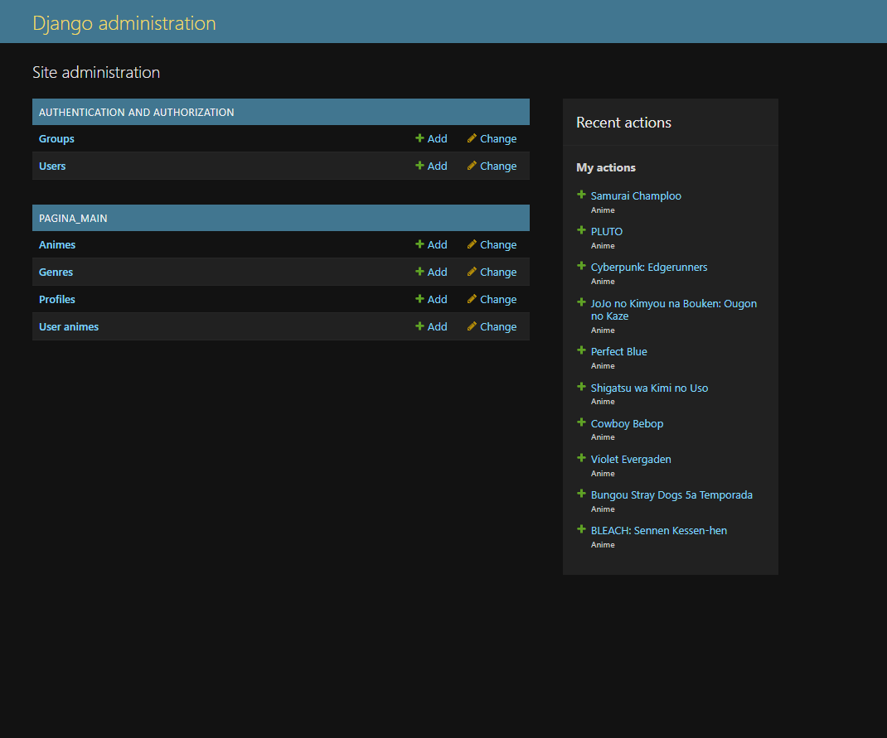

<br>


 - Pulsando en anime veremos todos los animes que han sido creados con sus características propias.

<br>


 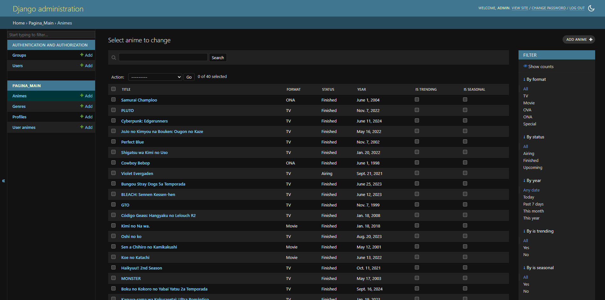

<br>


 - Si pulsamos en añadir anime tendremos la siguiente plantilla para añadir nuevos animes a la web, además de poder ponerlo en diferentes categorías de la aplicación, ya sea en tendencia o en seasonal(o las 2):

<br>


 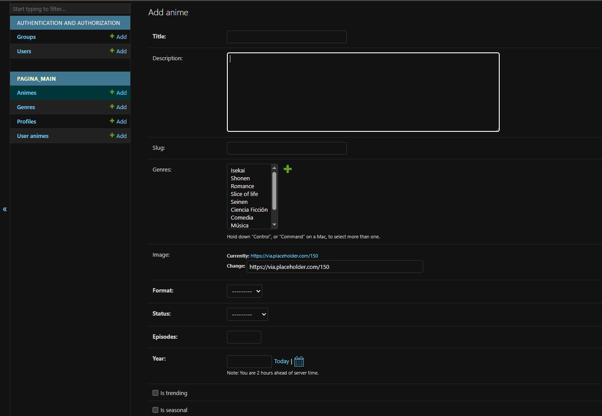

- En el apartado de géneros nos salen todos los generos creados para la web y asignarlo a un anime

   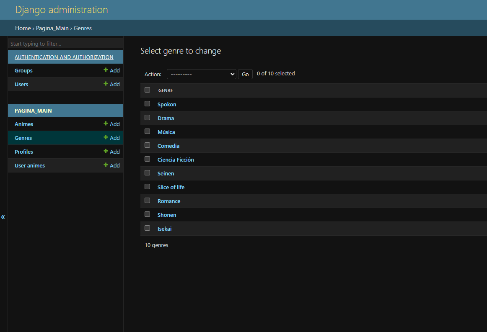

- Si nos vamos al apartado de perfiles, nos apareceran todos los usuarios que tienen un perfil en la web:
   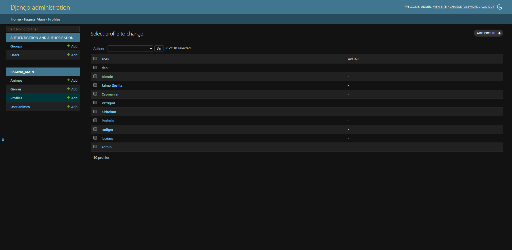
  
- Desde la parte de User Anime, podremos ver toda la actividad de la página, qué animes eligen los usuarios y las notas que les ponen a los mismos, además del estado y en la fecha que hizo esos movimientos

   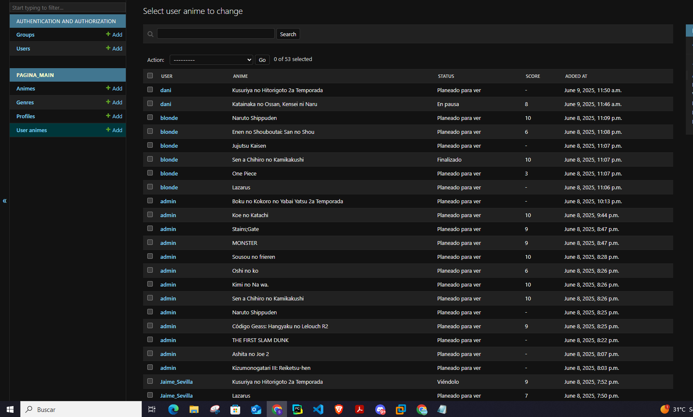

- Como se puede apreciar, desde el panel de administrador se puede controlar, practicamente casi todo lo que sucede en la aplicación, sin necesidad de acceder a la base de datos para comprobarlo.

### API:
- La api que he diseñado para la web está hecha por mi utilizando Django Rest framework y consiste en que todos los usuarios pueden puntuar cualquier anime, y de esas puntuaciones se hace una media de las notas y las mejores notas se muestran en la página principal. Para acceder a los datos de la api tenemos que escribir en el navegador la siguiente url:
  ```python
  hikarilist.yelardo.tech/api/animes
  ````
     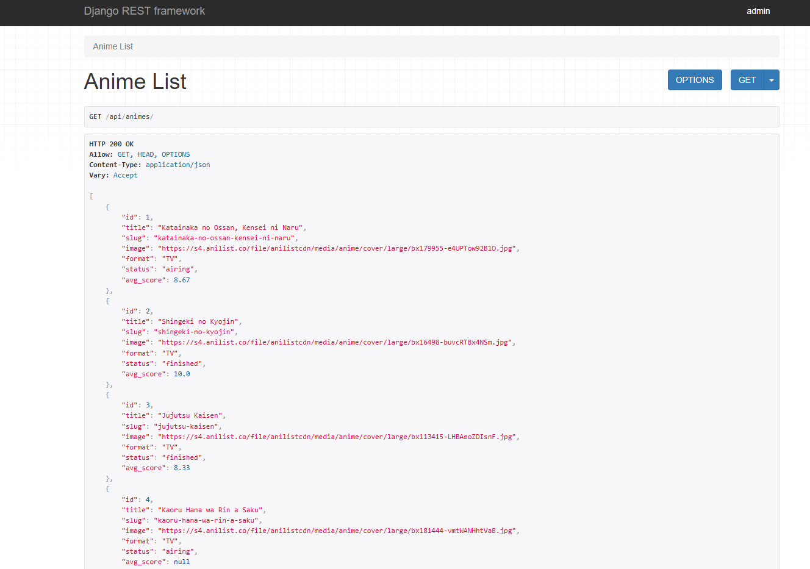

  
- Además podemos ver también el movimiento de los usuarios desde la api y las notas que les ponen:
    ```python
  hikarilist.yelardo.tech/api/ratings
  ````
   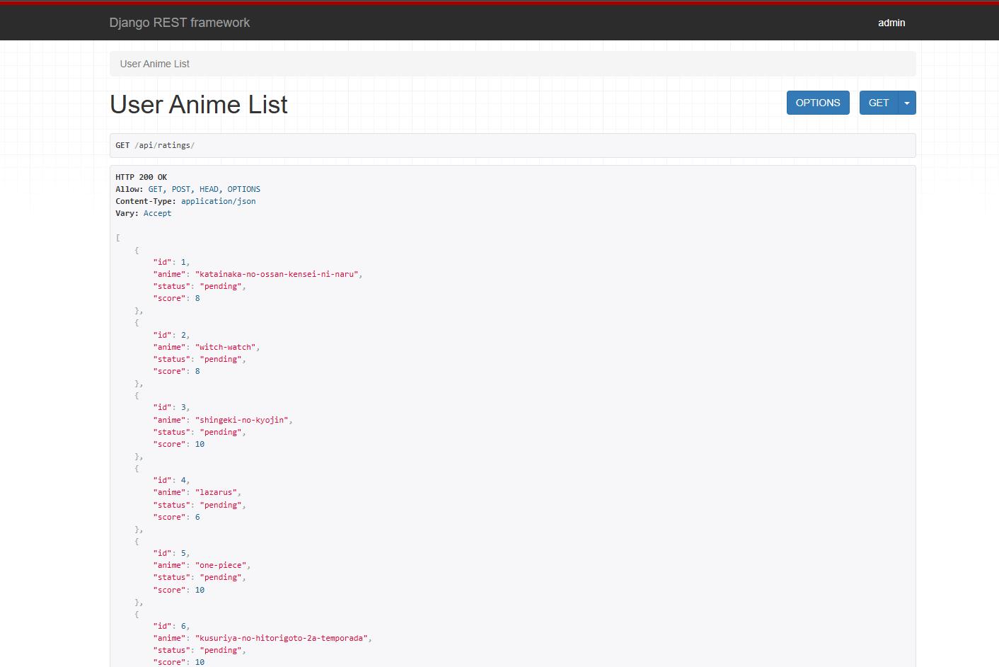

<br>

# Despliegue del proyecto 

## Cómo se ha realizado el despliegue:

### DOCKER Y DOCKER HUB
- Dockerizamos nuestro proyecto en local, para ello crearemos el arhivo Dockerfile
 ```python
FROM python:3.11-slim

ENV PYTHONDONTWRITEBYTECODE 1
ENV PYTHONUNBUFFERED 1

RUN apt-get update && apt-get install -y build-essential libpq-dev

WORKDIR /app

COPY requirements.txt .
RUN pip install --no-cache-dir -r requirements.txt

COPY . .

EXPOSE 8000
CMD ["python", "manage.py", "runserver", "0.0.0.0:8000"]

````
- Y necesitamos crear también el archivo docker-compose.yml y el .env
- Ponemos que la base de datos va a ser Postgresql y creamos una imagen para subirla a dockerhub, para que cuando estemos en la instancia de AWS, podamos pullear la imagen docker para lanzarla desde la instancia.
```python

services:
  web:
    image: yelarrdo/hikarilist:latest
    container_name: hikari_web
    command: python manage.py runserver 0.0.0.0:8000
    ports:
      - "8000:8000"
    env_file:
      - .env
    depends_on:
      - db
    restart: always

  db:
    image: postgres:15
    container_name: hikari_db
    volumes:
      - postgres_data:/var/lib/postgresql/data
    environment:
      POSTGRES_DB: ${POSTGRES_DB}
      POSTGRES_USER: ${POSTGRES_USER}
      POSTGRES_PASSWORD: ${POSTGRES_PASSWORD}
    ports:
      - "5432:5432"
    restart: always

volumes:
  postgres_data:

````
- .env:
```python
POSTGRES_USER=admin
POSTGRES_PASSWORD=admin123
POSTGRES_DB=hikari_db

````
- Una vez tengamos el proyecto dockerizado y funcione en local, lo subimos a la imagen en docker hub y nos vamos al AWS

<br>
  
### AWS, PROXY INVERSO Y DOMINIO EN .TECH

<br>

- La web en local ha sido desarrollada en Windows, por lo que todo el despliegue a sido desarrollado en una máquina virtual con debian 12, una vez iniciada y configurada toda la máquina virtual, procedemos a entrar al laboratorio de AWS, que 
tiene un máximo de duración de 4 horas, por lo que a a las 4 horas la instancia se para automaticamente y hay que volver a iniciarla.

<br>

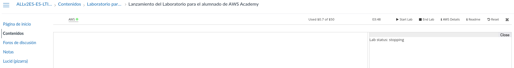

<br>

- Una vez dentro de AWS, procedemos a crear una instancia, en mi caso he hecho una instancia con debian 12, con 8gb de ram. Luego procedemos a crear una ip elástica y asociarla con nuestra instancia, el resultado final es tal que así:

<br>

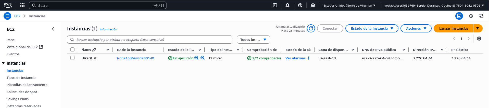

<br>

- Una vez tengamos nuestra instancia con la ip elástica, nos conectamos a ella mediante ssh.

<br>

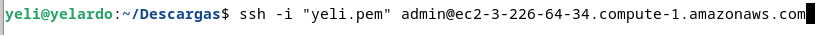

<br>


- Una vez conectada, deberemos crear una carpeta y pasar los archivos docker-compose.yml y el .env.
  
<br>

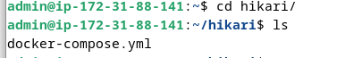

<br>

- Una vez que tengamos esos archivos procedemos a subir nuestra imagen de docker hub, primero hacemos el login y luego hascemos un docker pull para descargarnos nuestra imagen
  
<br>


<br>


- Una vez que lo tenemos todo, vamos a tech.domains y accedemos a nuestro dominio, dónde vamos a editar el A record y poner nuestra ip elástica.
  
<br>

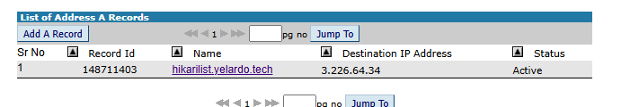

<br>
  
- Ahora realizaremos un proxy inverso con nginx dónde añadiremos nuestra url para que se despliegue nuestra imagen docker.
  
<br>

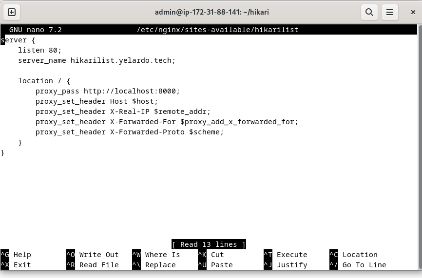

<br>

- Tras todo eso, si accedemos hikarilist.yelardo.tech podemos obvservar que la web se ha desplegado correctamente

<br>

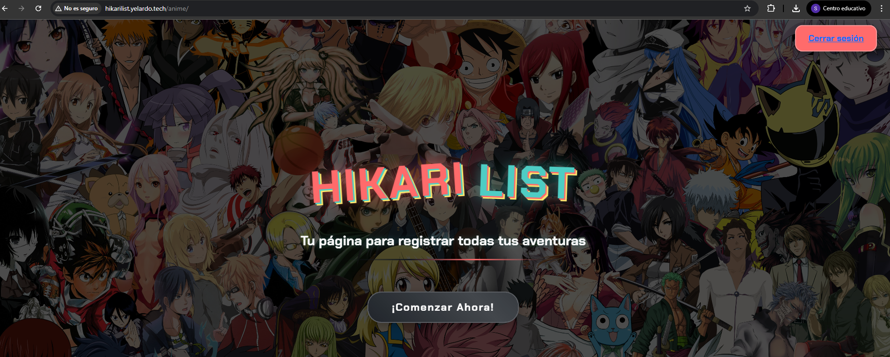

<br>


# FIN DE LA DOCUMENTACIÓN
 
  


  


 

 
  


